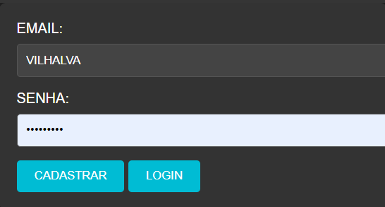

# CADASTRO E LOGIN COM PHP
👨‍🏫FORMULARIO EM HTML, CSS, PHP E MYSQL.

 <br>

## DESCRIÇÃO:
### INICIO:
Este é um exemplo simples de um sistema de cadastro e login em PHP que utiliza MySQL como banco de dados e a extensão PDO (PHP Data Objects) para interagir com o banco de dados. O sistema permite que os usuários se cadastrem com um email e senha, bem como façam login usando as credenciais cadastradas.

### ESTRUTURA DO PROJETO:
- `FORMULARIO.html`: Contém o formulário HTML com campos de email e senha.
- `FORMULARIO.php`: Lida com a lógica do cadastro e login dos usuários, incluindo a interação com o banco de dados.
- `FORMULARIO.css`: Arquivo CSS para estilizar o formulário.

### EXPLICAÇÃO DO CÓDIGO:
- O arquivo `FORMULARIO.php` é responsável pela lógica de cadastro e login dos usuários.
- O código PHP utiliza PDO para conectar-se ao banco de dados, coletar dados do formulário, inserir dados na tabela `clientes` e verificar as credenciais de login.
- O formulário HTML em `index.html` envia dados para o arquivo `FORMULARIO.php` usando o método POST.

### SEGURANÇA:
Este é um exemplo básico e não inclui todas as medidas de segurança necessárias para um ambiente de produção. Ao implementar um sistema de autenticação em um ambiente real, você deve considerar medidas adicionais de segurança, como:

- Validar e filtrar dados de entrada.
- Criptografar senhas usando funções de hash seguras, como `password_hash` e `password_verify`.
- Implementar proteção contra ataques de injeção de SQL.
- Usar sessões para gerenciar o estado de autenticação dos usuários.
- Implementar políticas de bloqueio de conta e recuperação de senha.
- Configurar HTTPS para proteger a transmissão de dados sensíveis.

## COMO USAR?
### BAIXANDO O PROJETO:
* Clone o repositório para o seu sistema local:

```bash
git clone https://github.com/VILHALVA/CADASTRO-E-LOGIN-COM-PHP.git
```

* Navegue até o diretório do projeto.

```bash
cd CADASTRO-E-LOGIN-COM-PHP
```

* Descompacte o arquivo ZIP (se você baixou manualmente):

```bash
unzip CADASTRO-E-LOGIN-COM-PHP.zip
```

### EXECUTANDO O PROJETO:
1. **Configuração do Banco de Dados:**

   - Crie um banco de dados MySQL chamado `registro`:
   ```sql
   CREATE DATABASE registro;
   ```
   - Execute o seguinte comando SQL para criar a tabela `clientes`:

     ```sql
     CREATE TABLE clientes (
         id INT AUTO_INCREMENT PRIMARY KEY,
         email VARCHAR(50) NOT NULL,
         senha VARCHAR(255) NOT NULL
     );
     ```

2. **Configuração do PHP:**

   - Abra o arquivo `FORMULARIO.php` e ajuste as configurações do banco de dados:

     ```php
     $servidor = "localhost";
     $username = "seu_usuario";
     $usersenha = "sua_senha";
     $database = "registro";
     ```

3. **Executando o Aplicativo:**

   - Coloque os arquivos em um servidor web compatível com PHP (por exemplo, XAMPP, WAMP, LAMP).
   - Acesse o formulário no navegador visitando `http://localhost/CODIGO/FORMULARIO.html`.
   - Use o formulário para se cadastrar com um email e senha ou fazer login com as credenciais cadastradas.

## NÃO SABE?
- Entendemos que para manipular arquivos em `HTML`, `CSS` e outras linguagens relacionadas, é necessário possuir conhecimento nessas áreas. Para auxiliar nesse aprendizado, oferecemos cursos gratuitos disponíveis:
* [CURSO DE HTML E CSS](https://github.com/VILHALVA/CURSO-DE-HTML-E-CSS)
* [CURSO DE PHP](https://github.com/VILHALVA/CURSO-DE-PHP)
* [CURSO DE MYSQL](https://github.com/VILHALVA/CURSO-DE-MYSQL)
* [CURSO DE MYSQL COM PHP](https://github.com/VILHALVA/CURSO-DE-MYSQL-COM-PHP)
* [CONFIRA MAIS CURSOS](https://github.com/VILHALVA?tab=repositories&q=+topic:CURSO)

## CREDITOS:
- [PROJETO CRIADO PELO VILHALVA](https://github.com/VILHALVA)


